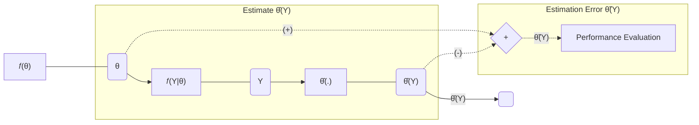

## Bayesian Framework

* Bayesian approach:

$$ \text { Consider parameters } {\color{BlueGreen}\theta} \text{ to be random variables } $$

* The parameters:

$$
\begin{gather}
\text { They have some } \mathit{ a \space priori } \text { distribution function } \mathit{f}_{\color{BlueGreen}\theta}(\theta)
\\
\\
\text { This distribution is called } \mathit{ a \space priori } \text { because it summarizes }
\\
\text { the knowledge we have about } {\color{BlueGreen}\theta} \text { before making any measurement. } 
\\
\end{gather}
$$

* Next, we make a _measurement_ `Y`

$$
\begin{gather}
\text { The measurement is not a deterministic function of the unknown parameters }
\\
\text { The random aspect of this relation is captured by the conditional distribution } \mathcal{f}_{Y|{\color{BlueGreen}\theta}}(Y|\theta)
\\
\end{gather}
$$

## Estimators

* _estimator_:

* _estimate_:

* we consider here a _point estimator_:

* a _statistic_:

* an _interval estimator_:

# References

- [ ] [JuliaCon 2018 | The Turing language for probabilistic programming | Hong Ge](https://www.youtube.com/watch?v=re4ggpDgoR0)
- [ ] [\[08x10\] Intro to Probabilistic Programming in Julia using Turing.jl and Pluto](https://www.youtube.com/watch?v=ixHKOz2vnoA)
- [ ] [Port of Statistical Rethinking (2nd edition) code to Julia](https://shmuma.github.io/rethinking-2ed-julia/)
- [ ] [Statistical Rethinking 2023](https://www.youtube.com/playlist?list=PLDcUM9US4XdPz-KxHM4XHt7uUVGWWVSus)

