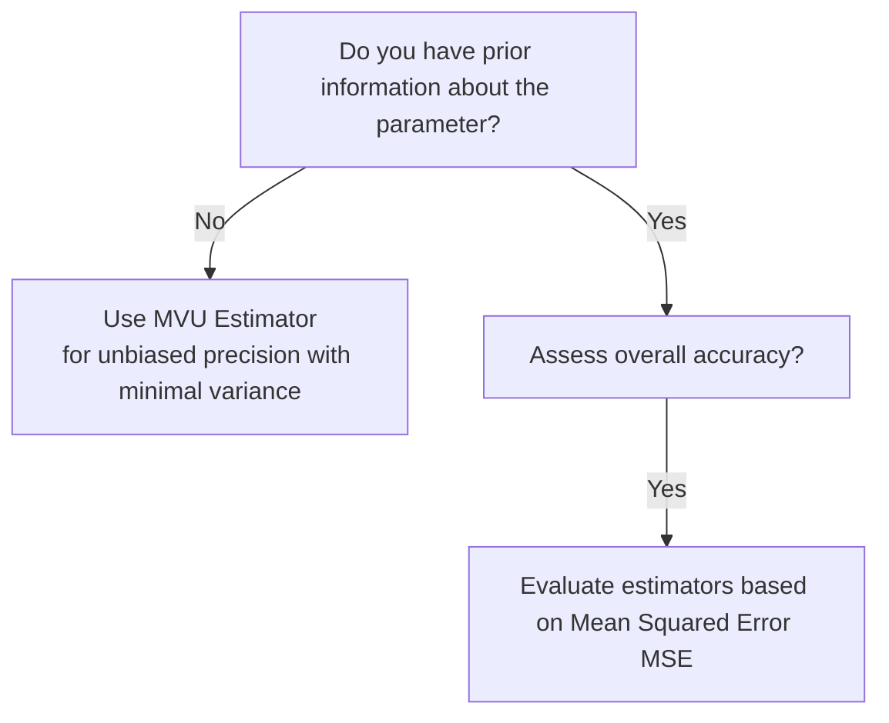

```mermaid
graph TD
    A[Do you have prior information about the parameter?] -->|No| B[Use MVU Estimator<br>for unbiased precision with minimal variance]
    A -->|Yes| C[Assess overall accuracy?]
    C -->|Yes| D[Evaluate estimators based on Mean Squared Error MSE]
```

